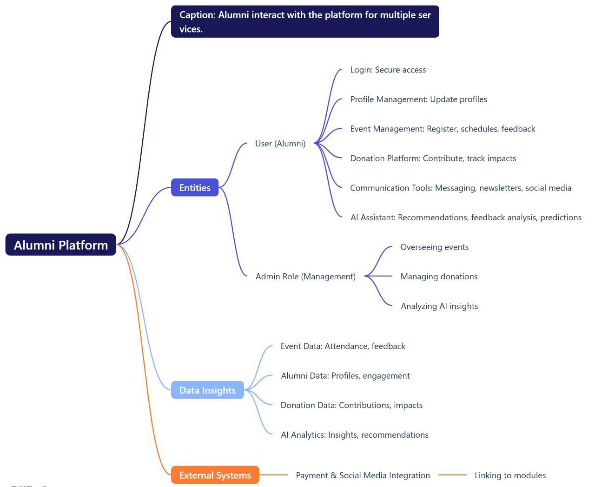

# Smart India Hackathon Workshop
# Date:01-12-2024
## Register Number:
## Name:
## Problem Title
Implementation of the Alumni Association platform for the University/Institute.
## Problem Description
Background: Alumni associations play a pivotal role in fostering lifelong connections between graduates and their alma mater, facilitating networking, mentorship, and philanthropic support. However, many alumni associations face challenges in maintaining engagement, facilitating donations, and providing valuable services such as job networking and tracking alumni success stories. A comprehensive Alumni Association platform for a University/Institute, encompassing both web and mobile applications, aims to address these challenges effectively. Detailed Description: The proposed Alumni Association platform for the Government Engineering College will feature robust functionalities accessible through both web and mobile applications: Alumni Registration: User-friendly registration processes on both web and mobile platforms, allowing alumni to join the association, update their profiles, and stay connected with peers and the institution. Donation Portal: Secure mechanisms on both platforms for alumni to contribute donations easily and support various initiatives and projects undertaken by the college, fostering a culture of philanthropy. Networking Hub: Dedicated sections on both platforms to connect alumni based on shared interests, professions, and geographic locations, facilitating professional networking, mentorship, and collaboration opportunities. Job Portal: Integrated job search and posting features accessible via web and mobile apps, enabling alumni to explore career opportunities, post job openings, and connect with potential employers within the alumni network. Alumni Directory: Search functionalities available on both platforms to find alumni based on different criteria such as graduation year, field of study, industry, location, etc., promoting networking and community building. Success Story Tracking: Features on both web and mobile apps to showcase and track alumni achievements, success stories, and notable contributions to society, inspiring current students and fostering pride among alumni. Events and Reunions: Announcements, registrations, and management tools available on both platforms for organizing alumni events, reunions, workshops, and professional development sessions to maintain engagement and connection. Feedback and Surveys: Channels on both web and mobile apps for alumni to provide feedback on their experiences, suggest improvements, and participate in surveys to help shape future initiatives of the association. The platform will prioritize user experience, security, and scalability across both web and mobile applications to cater to the diverse needs of the Government Engineering College's alumni community. Expected Solution: Implementation of the Alumni Association platform for the Government Engineering College, comprising both web and mobile applications, is expected to achieve several positive outcomes: Enhanced Alumni Engagement: Seamless access to networking, career opportunities, and alumni events through web and mobile apps will strengthen connections among alumni, fostering a vibrant and active community. Increased Philanthropic Support: Convenient donation processes accessible via both platforms will encourage alumni to contribute towards the college's growth and development initiatives. Career Advancement: Access to job postings, mentorship opportunities, and professional networking on mobile devices will support alumni in their career growth and advancement. Knowledge Sharing: Exchange of knowledge, experiences, and best practices facilitated through both web and mobile apps will enrich professional development and lifelong learning initiatives. Pride and Recognition: Highlighting alumni achievements and success stories on both platforms will instill pride in the alma mater and inspire current students to excel in their academic and professional pursuits. Community Building: Interactive features available on both web and mobile apps will nurture a sense of belonging and camaraderie among alumni, strengthening their bond with the institution. In summary, the Alumni Association platform for the University/Institute, integrated with both web and mobile applications, aims to create a dynamic and supportive ecosystem where alumni can connect, contribute, and thrive, thereby enriching the overall educational experience and legacy of the institution.
## Problem Creater's Organization
Government of Gujarat

## Idea

1. Alumni Networking Portal

Profile Creation: Allow alumni to create and maintain personal profiles showcasing their achievements, career progress, and contributions.
Job Postings & Hiring: Provide a space where alumni can post job opportunities, hire fellow alumni, or seek mentorship.
Social Interaction: Enable alumni to share stories, posts, and engage in discussions, promoting stronger community connections.

Impact:

Strengthens professional and personal bonds within the alumni community.
Facilitates job support and career advancement for alumni.

2. Personalized Engagement & Communication

AI-Generated Personalized Messages: Use AI to create tailored messages that reference alumni’s college experiences, like memorable events, clubs, or faculty recognition.
Milestone Celebrations: Send custom messages for birthdays, anniversaries, or career milestones, encouraging continued interaction and engagement.

Impact:

Increases alumni involvement by making them feel personally valued.
Strengthens emotional bonds with the institution, leading to higher engagement.

3. Donation Transparency Platform

Dedicated Donation Pages: Create engaging donation pages for specific causes (scholarships, infrastructure, etc.), including dynamic progress sliders to show real-time fundraising progress.
Impact Videos: Share videos demonstrating how funds are used, showcasing improvements or scholarships funded by donations.
Personalized Return Gifts: Send personalized thank-you messages and small tokens (e.g., certificates or videos) to alumni who donate, showing appreciation for their support.

Impact:

Builds trust and transparency around donations, increasing the likelihood of contributions.
Encourages alumni to make recurring donations, supporting long-term goals of the institution.

4. Success Story Tracking & Recognition

Proactive Success Tracking Team: Establish a team to actively track and reach out to alumni, identifying key achievements and milestones, ensuring that success stories are documented.
AI-Driven Success Prediction: Use data like academic performance, faculty comments, and extracurricular involvement to predict the success of alumni and highlight their stories.
Dynamic Success Profiles: Maintain updated profiles that include success milestones, and feature alumni in newsletters or on the platform, offering incentives like awards or recognition for sharing stories.

Impact:

Ensures success stories are consistently tracked and highlighted, motivating students and fellow alumni.
Creates a culture of sharing and celebrating achievements, inspiring current students.

5. Event Management & Reunions

Integrated Event Calendar: Provide a calendar with alumni events, offering personalized reminders for each user based on their preferences and interests.
Easy Registration & Ticketing: Facilitate event sign-ups with integrated registration forms, payment options, and ticketing services.
Feedback Mechanism: Collect feedback from alumni after events to assess participation and improve future events.
Memory-based Invitations: Send personalized invitations for events based on alumni’s college memories, encouraging higher event turnout.

Impact:

Enhances alumni participation in events and reunions through streamlined planning and communication.
Fosters a sense of community and connection, ensuring alumni stay engaged with their alma mater.

6. Open-ended Suggestions & AI Insights

AI-Driven Suggestion Collection: Allow alumni to submit open-ended suggestions for improving the alumni network, events, or services.
Categorized Suggestions: Use AI to categorize and identify common themes in alumni feedback, prioritizing the most frequent or important suggestions.
Transparency Dashboard: Display the actions taken based on alumni suggestions on a public platform, showing alumni how their feedback leads to real-world changes.

Impact:

Encourages alumni to share their ideas, fostering a sense of ownership in the alumni association.
Builds trust through transparency, showing that alumni feedback leads to tangible improvements in services and events.

## Proposed Solution / Architecture Diagram

## Use Cases

## Technology Stack

Technology Stack

Frontend: React.js
Backend: Node.js
Database: MySQL
AI/ML: TensorFlow or OpenAI API
Data Analytics: Python (Pandas, NumPy, Matplotlib)
Payment Gateway: Stripe or PayPal
Cloud Storage: AWS S3

## Dependencies

User Authentication: Secure login and profiles (7 days).
Event Management: Scheduling, ticketing, feedback (12 days).
Donation Platform: Payments, tracking, reports (8 days).
Communication Tools: Messaging, newsletters (10 days).
AI/ML Features: Recommendations, predictions (15 days).
Analytics Dashboard: Alumni, events, donations (10 days).
Integrations: Payment gateways, AWS (7 days).
Total Time: 60 days 
Budget: ₹50,000
